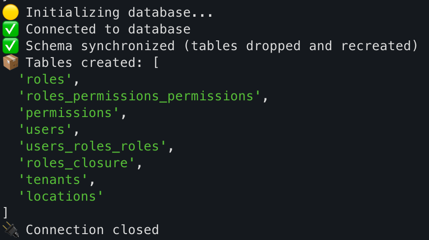
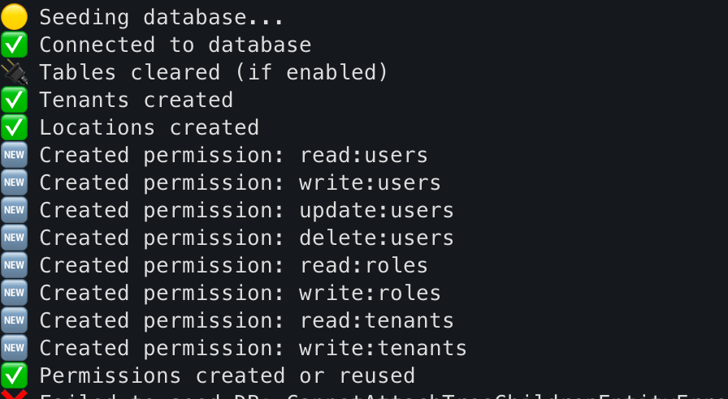
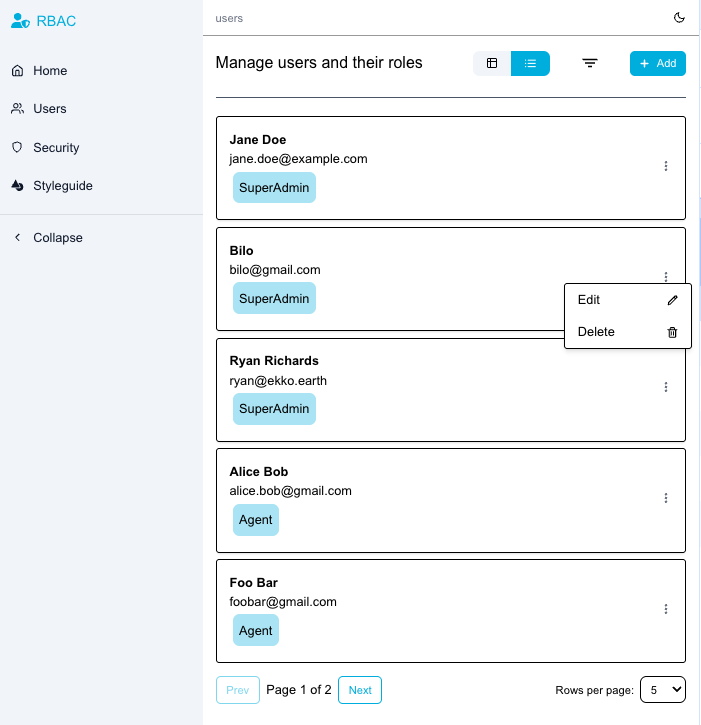
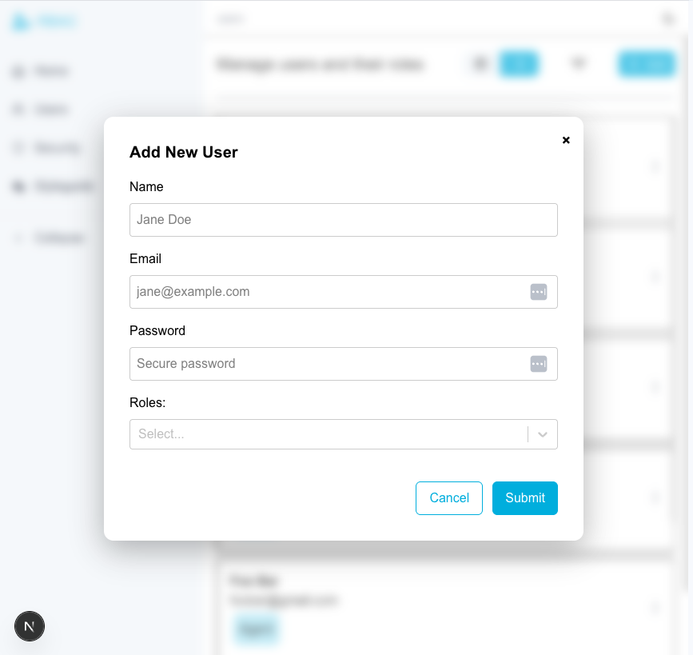
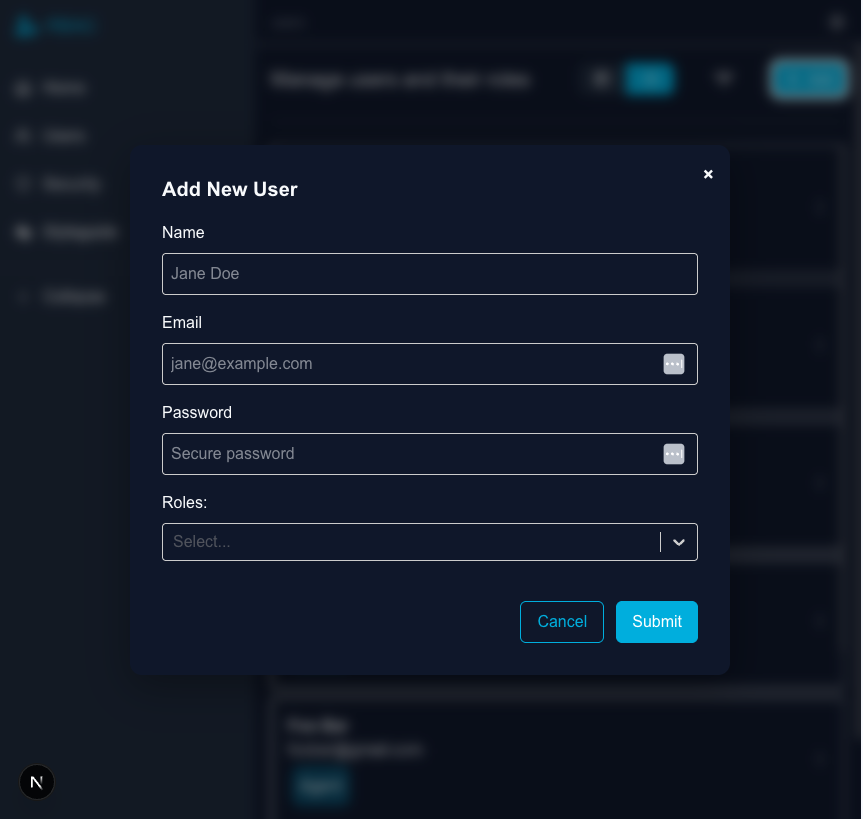
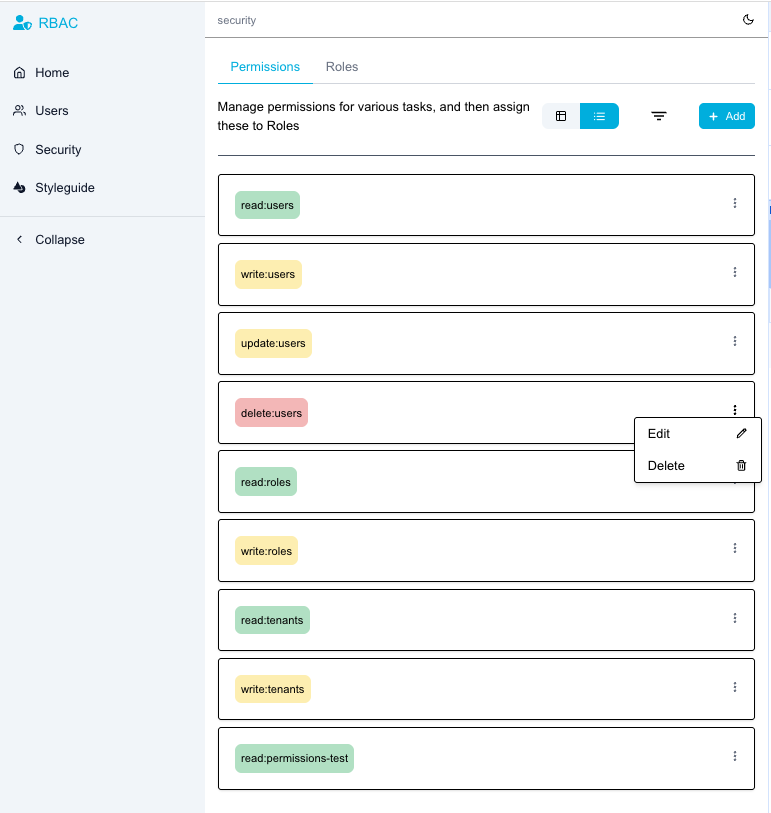
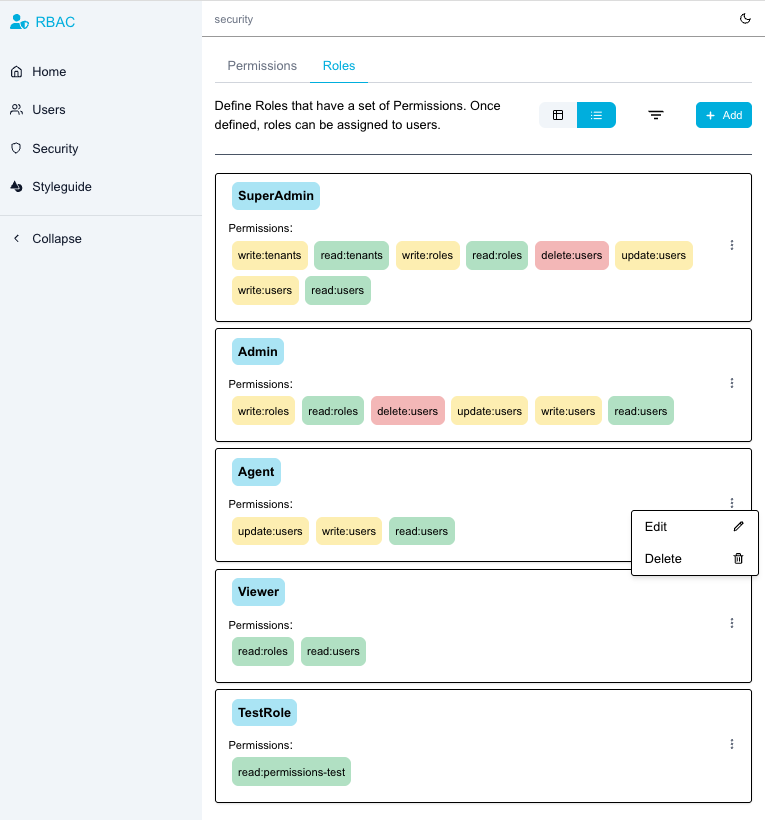
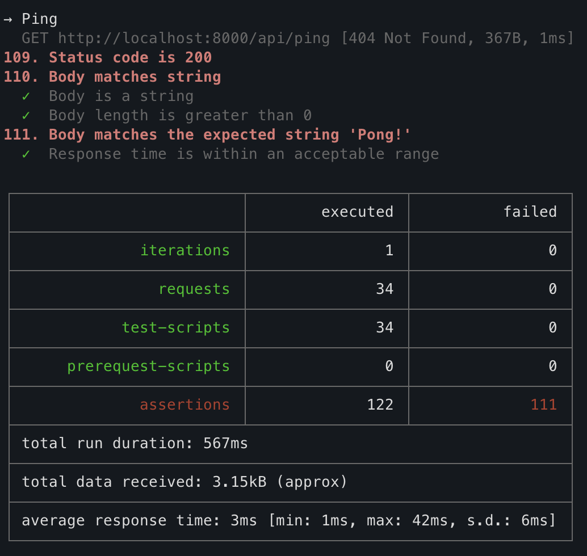
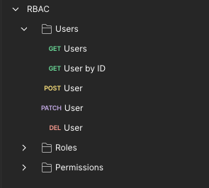
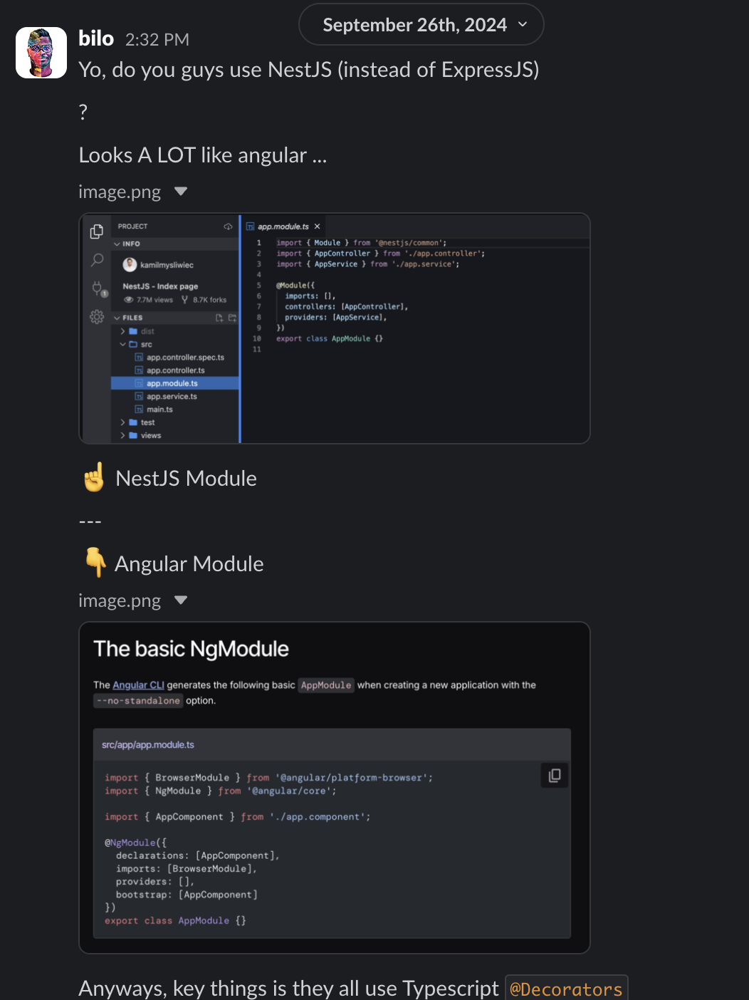

# Project Report

**Table of Contents:**

- [Project Report](#project-report)
  - [Overview](#overview)
  - [Requirements Gathering](#requirements-gathering)
    - [Tech Stack](#tech-stack)
    - [Priorities](#priorities)
    - [Research](#research)
    - [Approach](#approach)
  - [Implementation](#implementation)
    - [Project structure (Monorepo)](#project-structure-monorepo)
    - [API Design](#api-design)
    - [UX Design](#ux-design)
    - [Frontend Dev](#frontend-dev)
    - [Components](#components)
  - [Misc](#misc)
    - [Future Work](#future-work)
    - [Appendix](#appendix)
      - [1. NextJS vs Nestjs](#1-nextjs-vs-nestjs)

## Overview

In summary this project is about implementing an RBAC (role based access control) system with dynamic creating of users, roles and permissions, with a basic [demo video](https://drive.google.com/file/d/1pHNs6rKt83HbOMtYJ9S1Zvr28gH4iPNu/view)

The exact requirements can be found in the original [project spec (PDF)](./docs/ekko%20FS%20Challenge.pdf) within this repo.

The rest of this document outlines how I approached the project, communicates some of the decision making throughout, and indicates how I used AI tools to improve my productivity.

> **AI Tools**
>
> - I mainly used **ChatGPT** and Postman's **Postbot** for this assessment, and will indicate where throughout the report.
> - I am aware of other tools like **Cursor** and **v0**, but did not use the AI tools, as these have limited free usage.
> - Further, since **v0** (like **bolt.new**) generates entire projects (but kinda badly if not correctly prompted), I did not use this which can be confirmed from the git [commit history](https://github.com/bilo-io/mono-next/commits/main/) of this project.

## Requirements Gathering

### Tech Stack

As the project was intentionally vague, I engaged the team with a few questions, enquiring project tech stack, etc. 
I decided to put everything in a monorepo, as it would be easier to dev, demo and present.

| Tech                                                             | Stack    | Description                                                   |
| :--------------------------------------------------------------- | :------- | :------------------------------------------------------------ |
| [NextJS](https://nextjs.org/)                                    | Frontend | A React & Typescript project                                  |
| [NestJS](https://nestjs.com/)                                    | Backend  | A Node, Typescript API framework                              |
| [Postgres](https://www.postgresql.org/)                          | Database | A Database technology to persist data                         |
| [TypeORM](https://typeorm.io/)                                   | ORM      | Object Relational Mapper to interface with DB from Typescript |
| [react-hook-form](https://www.npmjs.com/package/react-hook-form) | Frontend | A custom hook library for react forms                         |
| [zod](https://www.npmjs.com/package/zod)                         | Frontend | Form validation for various fieldds                           |

> More detailed tech stack documented in the project [README.md](./README.md#tech-stack)

Thereafter I created a vertical slice consisting of a frontend `page` and backend `module` (controller, service, entity, repository, etc.), just to have a baseline of a working project.

### Priorities

After project setup was complete, I followed up on the priorities via email, and identified them like this

| Feature                 | Priority   | Path                                                        |
| :---------------------- | :--------- | :---------------------------------------------------------- |
| Downstream Access       | ✅ Top      | `src/api` backend + `src/app` frontend                      |
| Role Hierarchy          | ✅ Core     | Database + backend logic                                    |
| Multiple Roles per User | ✅ Required | TypeORM: schemas + backend logic                            |
| Permission Inheritance  | ✅ Required | Recursive access logic                                      |
| Functional UI           | ✅ Required | src/app/src – don’t overbuild, just clean                   |
| Docs                    | ✅ Required | High-impact, do this as you go in README.md                 |
| Scalability Notes       | ✅ Required | Add to root README.md and inline as comments where relevant |
| Tests                   | 🟡Optional  | One or two to show approach                                 |

### Research

As this was my first time building an RBAC system from the ground up, I had some reading to do:

- [User Role and Permission Management](https://frontegg.com/guides/user-role-and-permission)
- [Role design best practices](https://www.activityinfo.org/support/docs/permissions/role-design-best-practices.html)
- [User Role and Permission Design: How to Model IT Access](https://www.tenfold-security.com/en/permission-roles/)
- [Best Practices for Designing User Roles and Permissions System](https://www.aalpha.net/blog/best-practice-for-designing-user-roles-and-permission-system/)
- [Case study: Designing roles and permissions](https://medium.com/design-bootcamp/designing-roles-and-permissions-ux-case-study-b1940f5a9aa)


### Approach

After further investigation on the common approaches to tackle this, I generated this comparison matrix using ChatGPT:

| Strategy             | Description                                                                                | Pros                                                                                             | Cons                                                                                      |
| :------------------- | :----------------------------------------------------------------------------------------- | :----------------------------------------------------------------------------------------------- | :---------------------------------------------------------------------------------------- |
| 1. Adjacency List    | Each record stores a reference to its parent node (e.g. `parentId` column).                | - Simple schema and easy to modify. <br> - Good for shallow hierarchies.                         | - Recursive queries are slow. <br> - Hard to fetch full subtrees efficiently.             |
| 2. Nested Set        | Stores left and right boundaries for each node in the hierarchy (preorder traversal).      | - Very fast read access to subtrees. <br> - Great for static hierarchies.                        | - Expensive to insert or move nodes. <br> - Complex to maintain programmatically.         |
| 3. Materialized Path | Each node stores its full path from root as a delimited string (e.g. `/ceo/manager/lead`). | - Simple to implement and understand. <br> - Easy to get ancestors with LIKE queries.            | - Refactoring paths is costly. <br> - Limited support for deep queries in some databases. |
| 4. Closure Table     | Uses a separate table to store all ancestor-descendant pairs with depth level.             | - Super fast for querying any depth (descendants or ancestors). <br> - Supports complex queries. | - Extra table and joins add complexity. <br> - Slightly more overhead on writes.          |

> **AI Usage**: Generating some code, specifically
>
> - ChatGPT to see what the pros and cons of the problem statement were, with a full breakdown of these
> - Database: `init` & `seed` scripts using TypeORM, to quickly generate realistic/meaningful data.
> - Components: Rather than using a specific component library, I generated a few custom components as I needed them, specifying the props and interface to make them simple and consistent

**Deciding on approach**:

- It was stated that the system needs to work for a larger set of data efficiently (10k)
- I decided to use Use Closure Table with `@Tree('closure-table')` because:
  - It’s built-in to TypeORM.
  - Fast to query both up and down.
  - Less boilerplate to maintain than **nested sets** or **materialized paths**.
  - Fits the need to handle users with multiple roles.

## Implementation

### Project structure (Monorepo)

The project was a monorepo, using `pnpm` to leverage its advantages for such a project setup.
This is the highlevel structure, with the frontend `app` and the backend `api` in the root `src` folder.

```sh
├── docs
│   └── Next_vs_Nest.png
├── node_modules
│   └── concurrently -> .pnpm/concurrently@9.1.2/node_modules/concurrently
├── package.json
├── pnpm-lock.yaml
├── pnpm-workspace.yaml
├── src
│   ├── api
│   │   ├── dist
│   │   ├── node_modules
│   │   ├── package.json
│   │   ├── pnpm-lock.yaml
│   │   ├── src
│   │   ├── test
│   │   ├── tsconfig.build.json
│   │   ├── tsconfig.json
│   │   └── tsconfig.original.json
│   ├── app
│   │   ├── next-env.d.ts
│   │   ├── next.config.ts
│   │   ├── node_modules
│   │   ├── package.json
│   │   ├── postcss.config.mjs
│   │   ├── public
│   │   ├── src
│   │   └── tsconfig.json
│   └── shared
│       ├── types
│       └── utils
└── tsconfig.base.json
```

### API Design

There are 3 modules, [User](https://github.com/bilo-io/mono-next/tree/main/src/api/src/users), [Role](https://github.com/bilo-io/mono-next/tree/main/src/api/src/roles), and [Permission](https://github.com/bilo-io/mono-next/tree/main/src/api/src/permissions), with the exact files and schemas defined in the linked folders.

For each vertical slice I used the recommended NestJS module structure, similar, but different to Angular, as discussed in our initial meeting.

> NOTE: I did actually make this discovery when first looking at NestJS out of curiosity (never actually using it), as indicated in [Appendix 1](#1-nextjs-vs-nestjs)

| Endpoint     | Method/Verb | Description                                                                                  |
| :----------- | :---------- | :------------------------------------------------------------------------------------------- |
| `/users`     | `POST`      | **Creates** a new user with the request payload (`create-user.dto.ts`)                       |
| `/users`     | `GET`       | **Reads** users from the database (pagination with query `?page=1&limit=10`)                 |
| `/users/:id` | `GET`       | **Reads** a single user *where* the user.id matches                                          |
| `/users/:id` | `PATCH`     | **Updates** the user with the respective `user.id` and payload (`update-user.dto.ts`) <br /> |
| `/users/:id` | `DELETE`    | **Updates** the user with the respective `user.id` and payload (`update-user.dto.ts`)        |

> - I chose `PATCH` instead of `PUT` because the former does not require the entire request body, but just a partial body, allowing more flexibility.
> - I used the same endpoint structure for the other two vertical slices (`roles` and `permissions`), and would have implemented a few additional endpoints as required for the more complex logic.

As mentioned previously I also created 2 scripts to initialise and populate the DB:

`pnpm db:init`:


`pnpm db:init`:


### UX Design

I drew UX inspiration from the following resources, in order to  used basic user interaction instead of trying to re-invent the wheel:

- [Dribble: Roles and Permissions UI](https://dribbble.com/search/roles-and-permissions-ui)
- [Behance: User Permissions](https://www.behance.net/search/projects/user%20permissions)

This is what I came up with:




> PS: I also added theme switching, using `React Context`



**Permissions** and **Roles** live on separate tabs, under the **Security** page.




### Frontend Dev

I built a basic page structure with reusable components and custom hooks where possible.

Slimmed down page structure, to make it easily digestable:

```tsx
# imports

# static view config => could be abstracted into a `constants` file/folder
type ViewType = 'table' | 'list';
const viewOptions: {
    value: ViewType,
    icon: ReactNode
}[] = [
    { value: 'table', icon: <FiTable className="w-4 h-4" /> },
    { value: 'list', icon: <FiList className="w-4 h-4" /> },
];

export const PageTemplate = () => {
  // #region HOOKS
  const { theme } = useTheme();
  const [query, setQuery] = useState<any>({
      page: 1,
      limit: 10
  });
  // ...
  // #endregion

  // #region CRUD
  const { data: pageData, loading, error, retry: fetchData } = useFetch<PaginatedResponse<User>>(`/users`, {
        auto: false,
        method: 'GET',
        onError: () => {
            showToast('Data failed to fetch', 'success')
            fetchData()
        },
    })
  const { data: pageData, retry: createData } = useFetch<PaginatedResponse<User>>(`/users/create`, {
        auto: false,
        method: 'POST',
        onSuccess: () => {
            showToast('Data created', 'success')
            fetchData()
        },
    })
  // #endregion

  // #region HANDLERS
  const handleCreate = (item: User) => { 
    /*...*/ 
  }
  // #endregion

  return (
    <Layout>
       <div>
         <Toggle<ViewType> />       {/* list vs table view  */}
         <ToggleFilters />          {/* Modal to create entity */}
         <AddEntityModal />         {/* Modal to create entity */}
       </div>

      <Collapsible />               {/* WIP: filters for endpoint */}
      
      {/* Asycn is a custom wrapper to handle basic API's, retry button, show errors etc. 
      - preloader: Skeleton when there is no data (initial state)
      - loader: normal Spinner when data is present on the page
      */}
      <Async isLoading={loading} onRefresh={fetchData}>
        {
          {view === 'table' && (
              <Table<User>
                  rowData={users?.data || []}
                  columnDefs={columns}
                  height={'500px'}
              />
          )}
          {view === 'list' && (
              <List<User>
                  items={pageData}
                  renderItem={() => (
                    <div>
                      <div />         {/* All the fields depending on the list view*/}
                      <ContextMenu /> {/* Accessing CRUD operations for an existing item (Edit & Delete) */}
                    </div>
                  )}
              />
          )}
        }
      </Async>

      <Pagination
          page={query.page}
          limit={query.limit}
          onChange={handlePagination}
          total={users?.meta?.total as number}
      />
    </Layout>
  )
}
```

### Components

A lot of the simple/"dumb"/view components and custom React hooks were generated with AI. I have built these so often in various projects that I did not want to spend time on this.

Due to my familiarity with frontend, I specified the exact props, and how I wanted to use them with only minor changes.

> (e.g. ChatGPT kept using Tailwind for colors, whereas I wanted to use my custom hook and a strongly typed theme.).

- ToastProvider
- ThemeContext
- components/ui
- `useFetch`
- `useHover`

## Misc

### Future Work

- [1/3] Fix the respective hosting platform builds to get everything hosted so it can be used beyond just `localhost`
- [X] Form Validation on the frontend (backend validation happens with NestJS implicity when using TypeORM etc.)
- [X] Export the postman collection & env, add to project, and use [newman](https://www.npmjs.com/package/newman) to run any changes against this in the terminal (I do this for other projects)
- Definitely clean things up a bit more
- Update the UI/UX to properly represent the tree and branch structure as the assessment requirements stated
- Add more unit tests, integration and e2e tests
- Add Chromatic & Storybook for visual regression testing using
- Add a Github actions file to control the CI pipeline better (`build`, `lint`, `test`, `deploy`)
- Fix the seed script (it broke at some point while I was changing the schemas)

Example output of newman in one of my other projects:



Current Postman collection:



### Appendix

#### 1. NextJS vs Nestjs

I had a conversation with my friend on Slack in September 2024, when first looking at Nest out of curiosity, only to be disapsinted they didn't use it.



